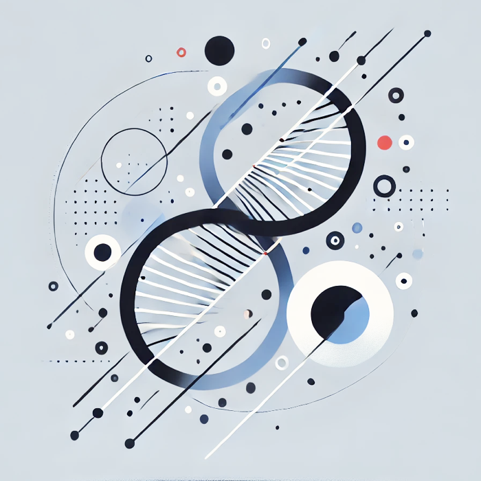

---
listing:
  contents: posts
  sort: "date desc"
  type: table
  categories: true
  sort-ui: true
  filter-ui: true
  fields: [date, title, author, reading-time]
page-layout: full
title-block-banner: false

---

:::{}
{width=150 style="float: left; margin: 5px 10px 0px 0px;"}

Welcome! I'm an inter-disciplinary scientist at Allen Institute for Brain Science in Seattle. In my day job I build machine learning tools to understand organization principles of the mammalian brain. I have an undergraduate degree in Engineering Physics from IIT Bombay and a PhD in Physics from Northeastern University. I am also a certified strength and conditioning coach ([CSCS](https://certificates.nsca.com/258ebe25-e328-489b-806f-fabbc99a583d).
:::

I became more interested in improving my own physical health and fitness in my 30's ([more thoughts about my "why" here](https://substack.com/home/post/p-46208024)). I write this blog as a way to summarize my understanding, keep track of primary sources and interesting papers.

I'd love to hear your thoughts and comments. I'm also interested in writing collaborative blog posts - please reach out! 

:::{style="font-size: 80%;"}
✉️ | [rhngla@gmail.com](mailto:rhngla@gmail.com)  
🏠 | [rhngla.github.io](https://rhngla.github.io)  
🦋 | [rhngla.bsky.social](https://bsky.app/profile/rhngla.bsky.social)  
:::

---